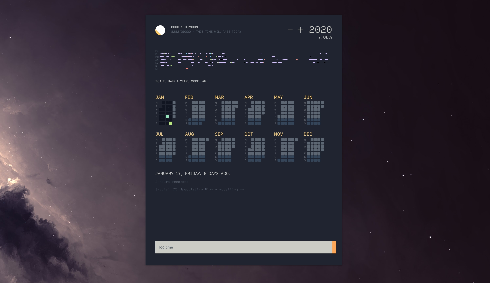

# Jars

For the longest time I used three markdown files that I kept in an always-open text editor to organize my life. I built _Jars_, so named after the [Chris Crawford ritual](http://www.erasmatazz.com/personal/self/sixty.html), as an answer to those markdown files.

Jars stores your logs either locally, enabling it to run without an internet connection entirely, or on a remote server so that one can save tasks and view them wherever. The server need not be the particular one I've elected to use, so long as the endpoint functionality is the same. See credits and `/server` for more details.

You can find Jars ready-to-run for your own use [here](https://github.com/stockHuman/Jars/releases/).

Upon first use you'll be asked to provide a .json file formatted with at least some of these settings:

```js
{
	"APIurl": "string", // API URL, if you have one.
	"mode": "local", // or CRUD. Optional
	"dateOfBirth": "MM/DD/YYYY", // to calculate the logo
	"motto": " - a motto of yours, optional",
	"colors": {
		"code": "#D4BFFF", // color the categories
		"read": "#A6CC70", // within the visualizer!
		"arts": "#F28779", // This is simply a key / val
		"docs": "#73D0FF"  // pair with hex codes
	}
}
```

View the `/desktop` directory to view the codebase and install.

## Credits

This app contains no external dependencies beyond Electron, which is not strictly speaking necessary, but does rely on some modern Javascript. An ES6+ capable browser that understands async/await, fetch() et al. should do fine if you so desire to run it without electron.

A prominent component of this version of Jars utilises a calendar representation written by [Alexey Botkov](https://github.com/nomand/). Jars' visual design, raison d'etre and current programming ethos were heavily inpired by [a close friend's log](https://v-os.ca/timekeeping) and associated projects.

Jars contains code from the following repos:

- [PHP CRUD API](https://github.com/mevdschee/php-crud-api), © 2019 Maurits van der Schee, [MIT](https://github.com/mevdschee/php-crud-api/blob/master/LICENSE)
- [Letnice](https://github.com/nomand/Letnice), © 2018 Alexey Botkov, [MIT](https://github.com/nomand/Letnice/blob/master/LICENSE.md)

Additional reading regarding Crawford: [Kotaku](https://kotaku.com/30-years-later-one-mans-still-trying-to-fix-video-gam-1490377821)

Color theme: [Ayu Mirage](https://github.com/ayu-theme)

## License

[GPL-3.0](licence.md)
